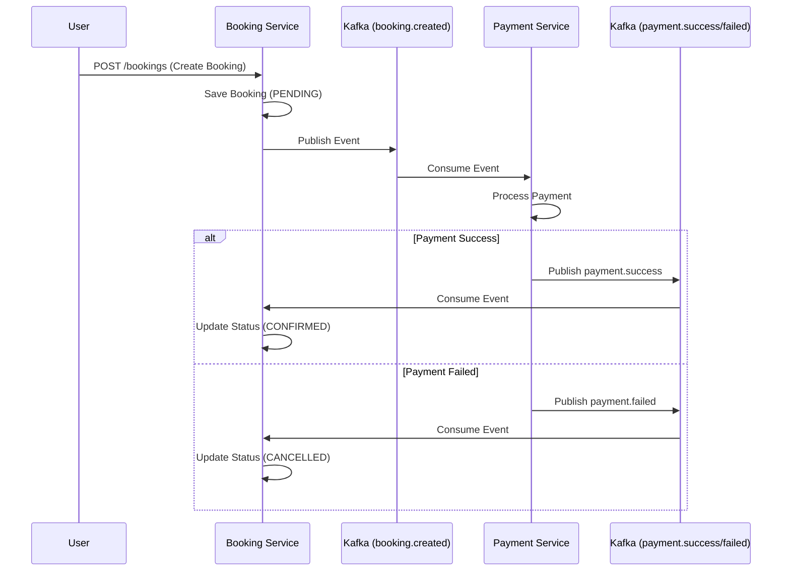

# TripNest: Distributed Travel Booking System

A scalable, event-driven microservices architecture for travel booking, built with Go, Kafka, and PostgreSQL.

## Architecture Overview

TripNest demonstrates a modern distributed system using **Choreography-based Sagas** for data consistency across services. It is designed to handle high concurrency and potential partial failures gracefully.

### Core Services

| Service | Status | Tech Stack | Responsibility |
| :--- | :--- | :--- | :--- |
| **User Service** | ✅ Completed | Go, PostgreSQL, JWT | User registration, authentication, and secure password handling. |
| **Booking Service** | ✅ Completed | Go, PostgreSQL, Kafka | Order management, state machine (PENDING → CONFIRMED/CANCELLED). |
| **Payment Service** | ✅ Completed | Go, PostgreSQL, Kafka | Payment processing, idempotency, event publishing. |
| **Search Service** | ✅ Completed | Go, MongoDB, Redis | High-performance search optimized for read-heavy workloads. |

### Event Choreography (Saga Pattern)

The system uses asynchronous messaging via Apache Kafka to coordinate cross-service transactions without a central orchestrator.



### Booking State Machine

1.  **PENDING**: Initial state upon booking creation.
2.  **CONFIRMED**: Transitioned when `payment.success` event is received.
3.  **CANCELLED**: Transitioned when `payment.failed` event is received or timeout occurs.

## Engineering Decisions

### Choreography-based Saga
We chose choreography over orchestration to decouple services. Each service reacts to events independently, reducing the single point of failure risk associated with centralized orchestrators.

### Idempotency
The Payment Service implements idempotency by using a unique constraint on the `booking_id`. Duplicate `booking.created` events are safely ignored, preventing double charges.

### Statelessness & Scalability
All services are stateless and containerized. Authentication is handled via stateless JWTs. This allows horizontal scaling of any service (e.g., running multiple replicas of the Booking Service consumer group) without session affinity issues.

### Kafka as Backbone
Kafka provides the durability and replayability needed for reliable event sourcing. It ensures that even if a service is temporarily down, events are not lost and can be processed once the service recovers.

### Search Optimization (CQRS-lite)
The Search Service uses MongoDB for flexible schema queries and Redis for caching frequent search results. This separates the read-heavy load from the transactional PostgreSQL databases used by User and Booking services.

## Setup Instructions

### Prerequisites
*   Docker & Docker Compose
*   Go 1.24+ (for local development)

### Running the System

1.  **Build and Start Services**
    ```bash
    docker compose build --no-cache
    docker compose up -d
    ```

2.  **Verify Services**
    *   User Service: `http://localhost:8080`
    *   Booking Service: `http://localhost:8081`
    *   Payment Service: `http://localhost:8082`
    *   Search Service: `http://localhost:8083`

3.  **Check Logs**
    ```bash
    docker logs -f tripnest-booking-service
    ```

### Frontend Setup

1.  **Install Dependencies**
    ```bash
    cd frontend
    npm install
    ```

2.  **Run Development Server**
    ```bash
    npm run dev
    ```

3.  **Access the UI**
    Open `http://localhost:3000` in your browser.

## API Testing (End-to-End Flow)

### 1. Register User
```bash
curl -X POST http://localhost:8080/register \
  -H "Content-Type: application/json" \
  -d '{"email":"user@example.com", "password":"password123", "first_name":"John", "last_name":"Doe"}'
```

### 2. Login (Get Token)
```bash
curl -X POST http://localhost:8080/login \
  -H "Content-Type: application/json" \
  -d '{"email":"user@example.com", "password":"password123"}'
```

### 3. Create Booking
```bash
# This triggers the Saga: Booking Created -> Payment Processed -> Booking Confirmed
curl -X POST http://localhost:8081/bookings \
  -H "Content-Type: application/json" \
  -d '{"user_id":"<USER_ID_FROM_STEP_1>", "resource_id":"flight-101", "total_amount": 250.00}'
```

### 4. Check Booking Status
Wait a few seconds for the async process to complete, then check the status:
```bash
curl http://localhost:8081/bookings/<BOOKING_ID_FROM_STEP_3>
```
Expected Output: `{"status": "CONFIRMED", ...}`

### 5. Search Listings (Search Service)
First, seed the database:
```bash
curl -X POST http://localhost:8083/seed
```
Then search:
```bash
curl "http://localhost:8083/search?destination=Paris&min_price=100&max_price=500"
```
