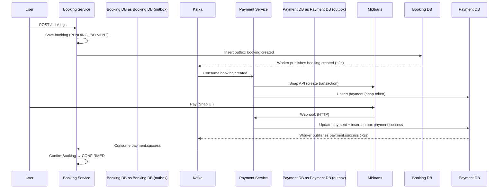

# TripNest: Distributed Travel Booking System

A scalable, **event-driven microservices** system for travel booking, built with Go, **Apache Kafka**, PostgreSQL, and an **outbox pattern** for reliable cross-service messaging.

## System Overview

TripNest coordinates **booking-service** and **payment-service** (and supporting services) using **Kafka topics**, not synchronous HTTP chains, for the payment lifecycle. Both booking and payment services **persist events in PostgreSQL (`outbox_events`) first**; background workers **publish to Kafka** on a short interval (~2 seconds). This matches the **transactional outbox** pattern: the database commit and the intent to publish stay consistent; Kafka delivery is asynchronous.

**Core messaging services (payment flow):**

| Component | Role |
| :--- | :--- |
| **booking-service** | Creates bookings (`PENDING_PAYMENT`), enqueues `booking.created`, consumes `payment.success` / `payment.failed`, confirms or cancels bookings, expires pending bookings and enqueues `booking.expired`. |
| **payment-service** | Consumes `booking.created`, creates **Midtrans Snap** transactions, exposes snap token HTTP API, handles **Midtrans webhooks**, updates payment rows, enqueues `payment.success` / `payment.failed`. |
| **Kafka** | Carries `booking.created`, `payment.success`, `payment.failed`, and `booking.expired`. |
| **Outbox** | `outbox_events` in each service DB; workers poll and publish to Kafka. |

Other services in the repo (User, Search, Inventory, etc.) support auth, search, and inventory; the table below highlights the main stack.

### Core Services

| Service | Status | Tech Stack | Responsibility |
| :--- | :--- | :--- | :--- |
| **User Service** | ✅ Completed | Go, PostgreSQL, JWT | User registration, authentication, and secure password handling. |
| **Booking Service** | ✅ Completed | Go, PostgreSQL, Kafka | Bookings, outbox, Kafka consumers for payment outcomes, booking expiry. |
| **Payment Service** | ✅ Completed | Go, PostgreSQL, Kafka | Midtrans Snap, webhooks, outbox, Kafka consumer for `booking.created`. |
| **Search Service** | ✅ Completed | Go, MongoDB, Redis | Search optimized for read-heavy workloads. |

### Event Flow (Choreography + Outbox)

Services react to Kafka events without a central orchestrator. **Publishing is not always immediate:** events are written to `outbox_events`, then a worker sends them to Kafka.


```mermaid
sequenceDiagram
    participant User
    participant Booking Service
    participant Booking DB as Booking DB (outbox)
    participant Kafka as Kafka
    participant Payment Service
    participant Payment DB as Payment DB (outbox)
    participant Midtrans

    User->>Booking Service: POST /bookings
    Booking Service->>Booking Service: Save booking (PENDING_PAYMENT)
    Booking Service->>Booking DB: Insert outbox booking.created
    Booking DB-->>Kafka: Worker publishes booking.created (~2s)
    Kafka->>Payment Service: Consume booking.created
    Payment Service->>Midtrans: Snap API (create transaction)
    Payment Service->>Payment DB: Upsert payment (snap token)
    User->>Midtrans: Pay (Snap UI)
    Midtrans->>Payment Service: Webhook (HTTP)
    Payment Service->>Payment DB: Update payment + insert outbox payment.success
    Payment DB-->>Kafka: Worker publishes payment.success (~2s)
    Kafka->>Booking Service: Consume payment.success
    Booking Service->>Booking Service: ConfirmBooking → CONFIRMED
```

## Payment (Midtrans Snap) — Implementation

- **Provider:** Midtrans **Snap** — HTTP `POST` to `{sandbox|production}/snap/v1/transactions` with **Basic** auth (`serverKey` + `:`).
- **Order ID format:** `ORD-<first 8 chars of booking UUID>-<unix timestamp>` (e.g. `ORD-5c3d4fdb-1776202502`).
- **Snap token:** Returned by Midtrans; stored on the payment row. Exposed via **GET** `/payments/snap-token?booking_id=...` on **payment-service** (port **8082**). If no payment exists yet, the service **fetches the booking** from booking-service and initializes Snap.
- **Webhook endpoints (all POST, same handler):**
  - `/payments/webhook`
  - `/webhooks/midtrans`
  - `/api/payments/webhook/midtrans`
- **Signature:** SHA-512 hex of `order_id` + `status_code` + `gross_amount` + **server key**, compared case-insensitively to `signature_key`.
- **Payment row status (webhook mapping):** Mapped to internal strings **`SUCCESS`** or **`FAILED`** (and outbox topics below). Midtrans `transaction_status` drives mapping (e.g. `settlement` / `capture` with acceptable `fraud_status` → success path).

## End-to-End Payment Flow

1. **Booking created** → persisted with status **`PENDING_PAYMENT`** and **`expires_at`** set.
2. **`booking.created`** → written to **booking** `outbox_events`, then published to Kafka by the booking-service outbox **worker (~2 s)**.
3. **payment-service** consumes **`booking.created`** → creates **Midtrans Snap** transaction → upserts **`payments`** (e.g. status `PENDING`, `midtrans_order_id`, `snap_token`).
4. **User pays** via Midtrans (Snap in the browser).
5. **Midtrans** calls the payment-service **webhook** (HTTPS POST).
6. **payment-service** validates signature and idempotency, **`UPDATE`s payment** by `midtrans_order_id`, then inserts **`payment.success`** or **`payment.failed`** into **`outbox_events`**.
7. **payment-service outbox worker** publishes **`payment.success`** (or **`payment.failed`**) to **Kafka**.
8. **booking-service** consumes **`payment.success`** (dedicated consumer group) → **`ConfirmBooking`** → status **`CONFIRMED`** if still **`PENDING_PAYMENT`**.
9. On **`payment.failed`**, booking-service **`CancelBooking`** → **`CANCELLED`** under the same precondition.

## Outbox Pattern

- Events are **stored in `outbox_events`** (PostgreSQL) with status **`PENDING`**, then marked **`PUBLISHED`** after a successful Kafka write.
- **Workers run about every 2 seconds** in both **booking-service** and **payment-service** (`FetchPendingOutboxEvents` → `Publish` → `MarkOutboxEventPublished`).
- On publish failure, rows are updated with **`retry_count`** / **`last_error`** (`MarkOutboxEventFailed`).
- **Reliability:** The business transaction and the “intent to notify” are committed together; Kafka lag or broker outages do not silently drop the intent (rows remain until published or retried).

## Booking Expiration

- **`expires_at`** is set in **`CreateBooking`**: `now + BOOKING_EXPIRY_MINUTES` (env), with a **minimum window of 10 minutes** enforced in service configuration.
- A **background worker** runs on an interval from **`BOOKING_EXPIRY_INTERVAL_SECONDS`** (default **60**; values below **60** are raised in config; the process also enforces a **minimum 1 minute** tick in code).
- Pending bookings with **`expires_at <= now`** are moved to **`EXPIRED`**; each expiry enqueues **`booking.expired`** on the **booking** outbox, which the same outbox worker publishes to Kafka topic **`booking.expired`**.

## Kafka Details

| Topic | Producer (path) | Consumer | Consumer group ID |
| :--- | :--- | :--- | :--- |
| **`booking.created`** | booking-service (outbox worker) | payment-service | **`payment-service-group`** |
| **`payment.success`** | payment-service (outbox worker) | booking-service | **`booking-service-group-payment-success`** |
| **`payment.failed`** | payment-service (outbox worker) | booking-service | **`booking-service-group-payment-failed`** |
| **`booking.expired`** | booking-service (outbox worker) | *(published for downstream; consumers depend on deployment)* | — |

**Idempotency:** Both services use a **`processed_messages`** table: insert **`(consumer_group, topic, message_key)`** on **`ON CONFLICT DO NOTHING`** so duplicate Kafka deliveries do not reprocess the same key.

**Brokers:** e.g. `kafka:9092` inside Docker Compose; configure via **`KAFKA_BROKERS`**.

## Booking State Machine (actual statuses)

| Status | Meaning |
| :--- | :--- |
| **`PENDING_PAYMENT`** | Initial state after **`POST /bookings`**. |
| **`CONFIRMED`** | Set when **`payment.success`** is consumed and **`ConfirmBooking`** updates from **`PENDING_PAYMENT`**. |
| **`CANCELLED`** | Set when **`payment.failed`** is consumed and **`CancelBooking`** updates from **`PENDING_PAYMENT`**. |
| **`EXPIRED`** | Set by the expiry worker when **`expires_at`** has passed while still pending payment. |

## Limitations & Edge Cases (from current code)

- **`ConfirmBooking` / `CancelBooking`** only transition from **`PENDING_PAYMENT`**. If the booking is already **`EXPIRED`**, confirmation will not apply (update is skipped).
- **Webhooks** whose **`order_id`** does **not** start with **`ORD-`** are **ignored** (no DB update, no outbox event) — avoids noise from non–TripNest Snap order IDs.
- **payment-service** **`booking.created`** consumer loop **exits on `ReadMessage` error** (`break`); the process may need a **restart** to resume consumption.
- **Outbox publish** in payment-service **skips** events with an **empty message key** (logged and marked failed).
- **Frontend:** Payment page loads Snap from the sandbox script and requests the token via a Next.js route that proxies to **`http://localhost:8082`** — suitable for local dev; production URLs and secrets must be aligned separately.

## Engineering Decisions

### Choreography-based Saga
Choreography decouples services. Each reacts to Kafka events; there is no central orchestrator process.

### Idempotency
- **Kafka:** `processed_messages` per consumer group / topic / message key.
- **Payments:** Webhook idempotency uses **`processed_webhooks`** (keyed by notification identity in code).
- **Payments:** `booking_id` is used to avoid duplicate Snap initialization where implemented.

### Statelessness & Scalability
Services are containerized; JWT auth is stateless. Consumer groups allow horizontal scaling **provided** partition assignment and idempotency rules are respected.

### Kafka as Backbone
Kafka provides durability; outbox bridges DB transactions with eventual Kafka delivery.

### Search Optimization (CQRS-lite)
Search uses MongoDB and Redis; transactional data stays in PostgreSQL for user, booking, and payment services.

## Setup Instructions

### Prerequisites
* Docker & Docker Compose
* Go 1.24+ (for local development)

### Running the System

1. **Build and Start Services**
   ```bash
   docker compose build --no-cache
   docker compose up -d
   ```

2. **Environment (payment-service)**  
   Compose expects **`MIDTRANS_CLIENT_KEY`** and **`MIDTRANS_SERVER_KEY`** from the host environment (see `docker-compose.yml`). Without them, payment-service will not start.

3. **Verify Services**
   * User Service: `http://localhost:8080`
   * Booking Service: `http://localhost:8081`
   * Payment Service: `http://localhost:8082`
   * Search Service: `http://localhost:8083`

4. **Check Logs**
   ```bash
   docker logs -f tripnest-booking-service
   ```

### Frontend Setup

1. **Install Dependencies**
   ```bash
   cd frontend
   npm install
   ```

2. **Run Development Server**
   ```bash
   npm run dev
   ```

3. **Access the UI**
   Open `http://localhost:3000` in your browser.

## API Testing (example flow)

### 1. Register User
```bash
curl -X POST http://localhost:8080/register \
  -H "Content-Type: application/json" \
  -d '{"email":"user@example.com", "password":"password123", "first_name":"John", "last_name":"Doe"}'
```

### 2. Login (Get Token)
```bash
curl -X POST http://localhost:8080/login \
  -H "Content-Type: application/json" \
  -d '{"email":"user@example.com", "password":"password123"}'
```

### 3. Create Booking
```bash
curl -X POST http://localhost:8081/bookings \
  -H "Content-Type: application/json" \
  -d '{"user_id":"<USER_ID_FROM_STEP_1>", "resource_id":"flight-101", "total_amount": 250.00}'
```

Response includes **`id`** and **`"status": "PENDING_PAYMENT"`**. A **`booking.created`** outbox event will be published to Kafka shortly.

### 4. Check Booking Status
```bash
curl http://localhost:8081/bookings/<BOOKING_ID_FROM_STEP_3>
```

Status stays **`PENDING_PAYMENT`** until a **successful Midtrans payment** and webhook processing produce **`payment.success`** and the booking-service consumer runs **`ConfirmBooking`**. Without completing payment, expect **`PENDING_PAYMENT`** (or **`EXPIRED`** after `expires_at`).

### 5. Snap token (payment-service)
```bash
curl "http://localhost:8082/payments/snap-token?booking_id=<BOOKING_ID_FROM_STEP_3>"
```

### 6. Search Listings (Search Service)
Seed the database:
```bash
curl -X POST http://localhost:8083/seed
```
Then search:
```bash
curl "http://localhost:8083/search?destination=Paris&min_price=100&max_price=500"
```
